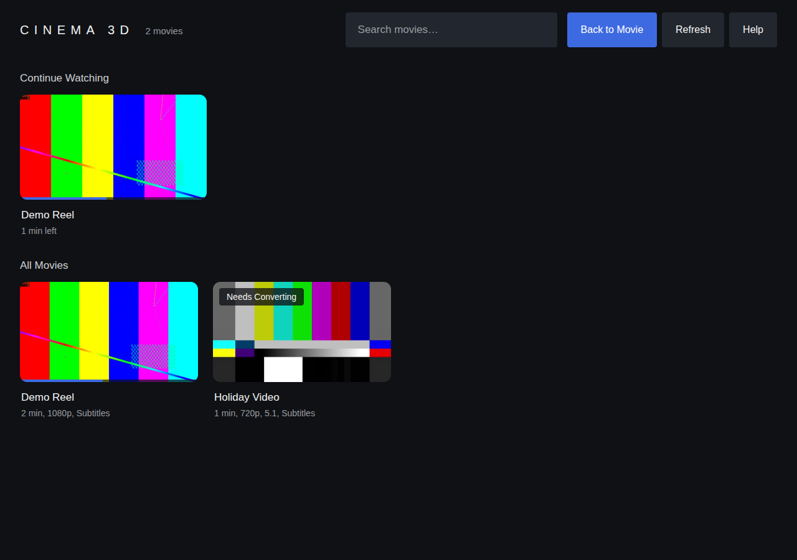
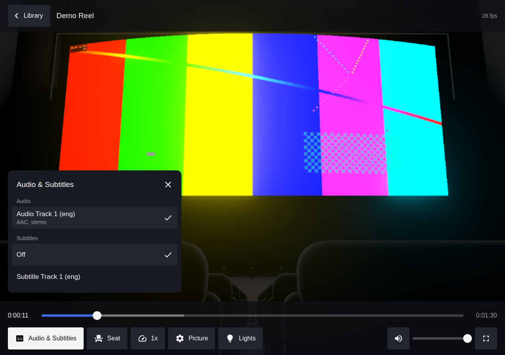
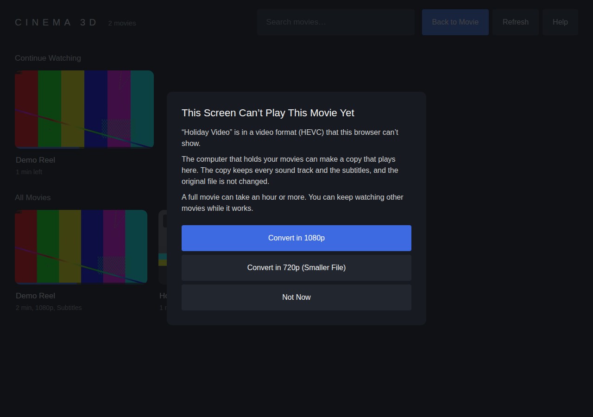
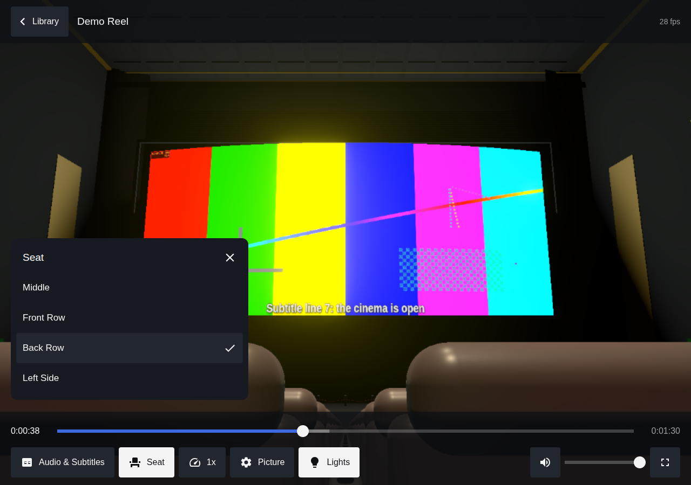

# 3D Cinema for car screens

Watch your own movies in a 3D cinema hall, in the browser of a Tesla or any other touchscreen.

Your movies stay on your own computer or phone. A small server streams them to the browser, which shows them on a curved cinema screen with 5.1 surround sound and subtitles. The controls are built for fingers on a car screen.

This is a fork of the **3D Web Cinema Player** by [Amit Sikdar](https://github.com/amitsikdar37) ([original project](https://github.com/amitsikdar37/am1t_builds/tree/main/3D%20Theater%20Webplayer)). The 3D theatre, the surround sound engine and the streaming idea are his work. This edition adds the touch interface, the library, converting, the PIN and the changes needed to use it from another device. See [NOTICE.md](NOTICE.md).

Not affiliated with or endorsed by Tesla, Inc.

| Library | Player |
|:---:|:---:|
|  |  |
| **Converting a movie** | **Back row, lights on** |
|  |  |

## What it does

- **Library** with posters, search, and a Continue Watching row that remembers where you stopped.
- **Touch controls**: large buttons, tap to show or hide them, double-tap the left or right side to jump 10 seconds, drag to look around.
- **Converting**: car browsers can't play every video format (4K HEVC files are the usual problem). Tap such a movie and the server makes an H.264 copy that plays, keeping every sound track and the subtitles.
- **Two views**: the 3D cinema, or a flat screen that is much lighter on a weak device.
- **Picture quality** setting. The car's browser starts in the lightest mode.
- **5.1 surround sound**, audio track switching and subtitles drawn on the cinema screen (from the original project).
- **PIN lock** for when other people share your network.
- Works with no internet: nothing is loaded from other websites.

## What you need

- A computer (Windows, macOS or Linux) or an Android phone to hold the movies and run the server.
- [Node.js](https://nodejs.org/) 20 or newer.
- Movie files: `.mp4`, `.mkv`, `.webm`, `.mov`, `.m4v` or `.ogv`.

## Quick start on a computer

```bash
git clone https://github.com/Abhinav00234/tesla-3d-cinema.git
cd tesla-3d-cinema
npm install
```

Put your movies in the `movies` folder (it is created on first start), then:

```bash
npm start
```

The server prints its addresses:

```
🍿 3D Cinema Media Server is running!
🎬 On this device:    http://localhost:3000
📶 Same WiFi/hotspot: http://192.168.1.23:3000
📁 Movies folder:     /home/you/tesla-3d-cinema/movies
```

Open `http://localhost:3000` on the same computer to check that it works.

## Opening it in the car

The car's browser has to be able to reach the device that runs the server. The simple way is to put both on the same network:

1. Turn on your phone's hotspot (or use home WiFi if the car is in reach of it).
2. Connect the car to it: **Controls > WiFi** on a Tesla.
3. Connect the computer to the same network, or run the server on the phone itself. See [docs/PHONE_TERMUX.md](docs/PHONE_TERMUX.md).
4. In the car's browser, type the `Same WiFi/hotspot` address the server printed.

The movie travels over the local network only, so it uses no mobile data.

Things to know about the car's browser:

- Tesla only plays video in the browser while the car is parked.
- It has no full screen button. The Help screen in the app explains a known workaround.
- It can't decode some formats. Those movies show **Needs Converting** in the library.

**Reaching it over the internet** (for a car with its own data plan, with the movies at home) is not built in. The server has a PIN lock, but you would have to make it reachable yourself, for example with a VPN or a secure tunnel you trust. Never put it on the internet without a PIN.

## Settings

Copy `config.example.json` to `config.json` and change what you need:

| Setting | What it does | Default |
|---|---|---|
| `port` | Port the server listens on | `3000` |
| `moviesDir` | Folder with your movies. Can be any path, also `~/Videos` | `movies` |
| `thumbnailsDir` | Where posters are kept | `thumbnails` |
| `pin` | Digits people must enter before the library opens. Empty means no PIN | empty |

The same settings can be given as environment variables: `PORT`, `MOVIES_DIR`, `THUMBNAILS_DIR`, `ACCESS_PIN`. If FFmpeg is installed somewhere unusual, set `FFMPEG_PATH` and `FFPROBE_PATH`.

## Converting movies

A movie the browser can't play shows **Needs Converting**. Tap it and pick 1080p or 720p. The computer running the server does the work and shows progress in the library. You can watch other movies meanwhile.

- The copy is saved next to the original as `Name.car.mp4`. The original is not changed.
- A full-length 4K movie can take an hour or more, depending on the computer.
- The library shows one card per movie and picks the right file by itself. In **Picture** you can choose whether to prefer the smaller copy or the original.

## Controls

| Touch | What happens |
|---|---|
| Tap the picture | Show or hide the controls |
| Double-tap the left or right side | Jump back or forward 10 seconds |
| Drag | Look around the cinema |

| Key | What happens |
|---|---|
| Space | Play or pause |
| Left / Right | Jump 10 seconds |
| Up / Down | Volume |
| F | Full screen |
| L | Cinema lights |
| M | Mute |
| O | Open the library |

## Docker

```bash
docker build -t cinema-3d .
docker run -p 3000:3000 -v /path/to/your/movies:/movies -e ACCESS_PIN=123456 cinema-3d
```

or `docker compose up -d` with the included `docker-compose.yml`. The Docker files were written but not test-built, so treat them as a starting point.

## Tests

```bash
npm test
```

The tests start the server on a spare port with a 3-second generated clip and check the library, streaming, subtitles, audio, the PIN lock, file safety and converting.

## Known limits

- **Not yet tried in a real car.** It was tested in desktop Chrome at car-screen sizes, including a browser with no HEVC support, which is the situation in the car. Please open an issue with what you find.
- Picture-based subtitles (PGS, DVD) can't be shown. Text subtitles work.
- One movie converts at a time.
- The 3D view needs a reasonable graphics chip. Use **Picture > Flat Screen** if it stutters.
- Watch progress is remembered per browser, not per person.

## More

- [docs/NOTES.md](docs/NOTES.md): how it is built, what changed from the original, and what was tested.
- [docs/PHONE_TERMUX.md](docs/PHONE_TERMUX.md): running the server on an Android phone.
- [DESIGN.md](DESIGN.md): the visual rules the interface follows.

## Licence and credit

ISC, see [LICENSE](LICENSE). Original 3D Web Cinema Player by Amit Sikdar. Full credits in [NOTICE.md](NOTICE.md).

Only use it with movies you have the right to watch.
